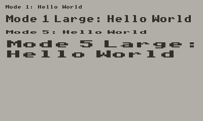

# Playdate Fonts

Any fonts I port to the Playdate. Currently that's just BBC Micro Mode 1 and the same font stretched to 2:1 for Mode 2/5:

Also check out the excellent [Playdate Arcade Fonts](https://github.com/idleberg/playdate-arcade-fonts) project.